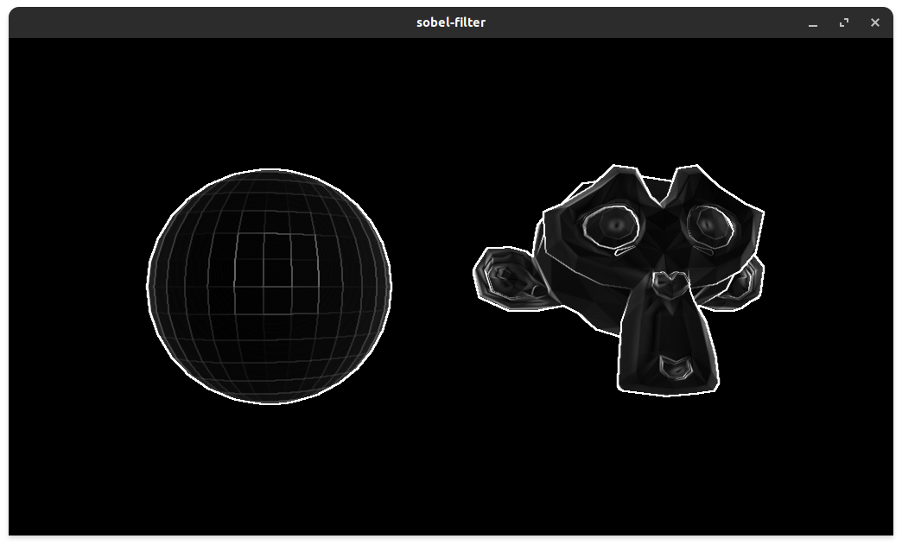
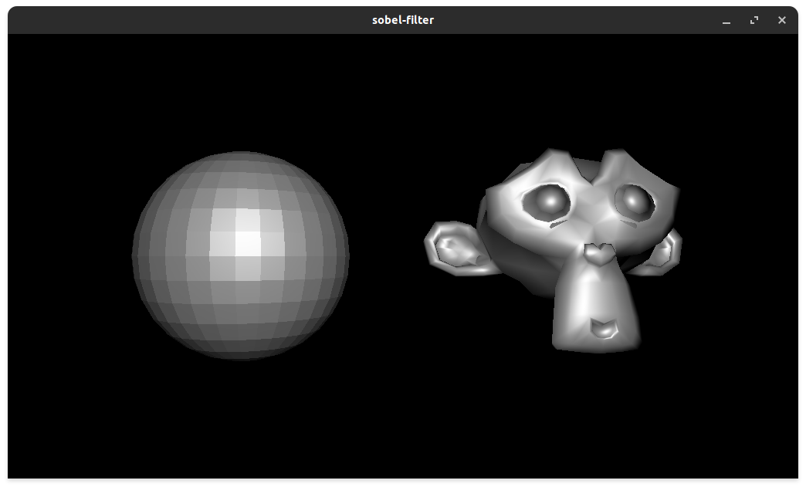

# Sobel-Filter-Example
A post-process effect that approximites edges in a renderer texture using OpenGL 4.4

## Building
Using Meson with the following dependencies installed:
- GLM
- SFML
- glBinding
- Assimp

## Snapshots

